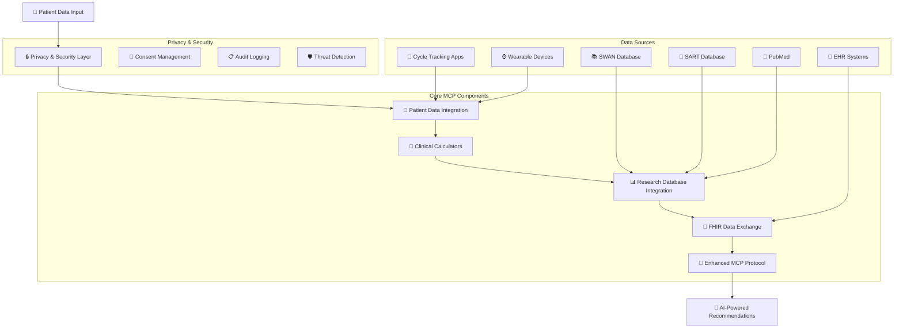

# Women's Health MCP - Enhanced Multi-Modal Context Protocol

🚀 **Multi-Modal Context Protocol for Women's Health AI Agents**

A comprehensive Model Context Protocol (MCP) implementation that addresses the critical infrastructure gap in women's health AI systems. This enhanced MCP provides AI agents with standardized, real-time access to reproductive health data sources while maintaining HIPAA compliance and privacy protection.

## 🌟 Challenge Solution Overview

This implementation solves the core problem identified in: **the lack of standardized infrastructure for women's health AI systems**. Our enhanced MCP enables AI agents to access:

- ✅ **Clinical Data**: EHRs (FHIR), lab results, imaging
- ✅ **Research Databases**: SWAN, SART, PubMed, clinical trials
- ✅ **Clinical Calculators**: Ovarian reserve, IVF success, menopause prediction
- ✅ **Guidelines**: ASRM, ESHRE treatment protocols
- ✅ **Patient-Generated Data**: Cycle tracking apps, wearables

## 🏗️ Enhanced Architecture Flowchart



## 📁 Project Structure

```
women-health-mcp/
├── servers/          # MCP server implementations
│   ├── asrm_server.py         # ASRM guidelines server
│   ├── nams_server.py         # NAMS menopause protocols
│   ├── pubmed_server.py       # PubMed research integration
│   ├── sart_ivf_server.py     # SART IVF success calculator
│   ├── eshre_server.py        # ESHRE guidelines
│   ├── elsa_server.py         # ELSA data integration
│   └── menopause_server.py    # Menopause prediction server
│
├── clients/          # Client implementations
│   ├── asrm_client.py         # ASRM client
│   ├── nams_client.py         # NAMS client
│   ├── pubmed_client.py       # PubMed client
│   └── nhs-typescript/        # NHS TypeScript client
│
├── core/             # Core MCP components
│   ├── womens_health_mcp.py   # Core MCP protocol
│   ├── clinical_calculators.py # Clinical calculation engines
│   ├── patient_data_integration.py # Multi-platform data sync
│   ├── privacy_security.py    # HIPAA compliance layer
│   ├── research_database_integration.py # Research DB access
│   ├── fhir_integration.py    # FHIR R4 interoperability
│   ├── biomini_intake.py      # Patient data ingestion
│   ├── netmind_router.py      # Query routing
│   ├── manus_agents.py        # Multi-agent reasoning
│   └── huggingface_integration.py # ML model integration
│
├── demos/            # Demo applications
│   ├── main.py                # Original demo entry point
│   ├── streamlit_demo.py      # Web interface demo
│   ├── enhanced_streamlit_demo.py # Enhanced web demo
│   ├── enhanced_mcp_demo.py   # Comprehensive MCP demo
│   ├── end_to_end_demo.py     # Pipeline orchestration
│   ├── complete_hackathon_demo.py # Full hackathon demo
│   ├── swan_mcp_demo.py       # SWAN data demo
│   ├── mcp_server/            # MCP server utilities
│   └── mcp_client_demo/       # MCP client examples
│
├── tests/            # Test suite
│   ├── test_asrm.py           # ASRM server tests
│   ├── test_nams.py           # NAMS server tests
│   ├── test_pubmed.py         # PubMed tests
│   ├── test_eshre.py          # ESHRE tests
│   ├── test_demo.py           # Demo tests
│   └── test_enhanced_demo.py  # Enhanced demo tests
│
├── scripts/          # Utility scripts
│   ├── setup_mcp.py           # MCP setup script
│   ├── run_server.py          # Server runner
│   ├── activate_claude_integration.py # Claude integration
│   └── fix_imports.py         # Import fixing utility
│
├── docs/             # Documentation
│   ├── HOW_TO_RUN_DEMO.md     # Demo instructions
│   ├── STREAMLIT_DEMO_GUIDE.md # Streamlit guide
│   ├── MCP_SERVER_GUIDE.md    # Server documentation
│   ├── DEMO_SUMMARY.md        # Demo overview
│   └── [additional guides]
│
├── config/           # Configuration files
│   ├── claude_*.json          # Claude MCP configs
│   ├── dans_env.example       # Environment template
│   └── [additional configs]
│
└── data/             # Data files
    ├── pipeline_output.json   # Pipeline results
    └── enhanced_mcp_demo_output.json # Demo outputs
```

## 🔄 Enhanced Data Flow

### Privacy-First Multi-Modal Pipeline
1. **Patient Consent & Security** → HIPAA-compliant privacy layer with granular consent management
2. **Multi-Platform Data Integration** → Real-time sync from Clue, Oura, Apple Health, EHR systems
3. **Clinical Calculations** → Evidence-based ASRM/ESHRE calculators for ovarian reserve, IVF success, menopause timing
4. **Research Database Queries** → Live access to SWAN, SART, PubMed for population data and latest research
5. **FHIR Data Exchange** → Standards-compliant interoperability with healthcare systems
6. **AI-Powered Synthesis** → Comprehensive recommendations with full audit trail

## 🚀 Quick Start

### Prerequisites
```bash
# Install dependencies
pip install -r requirements.txt
```

### 🌐 Web Interface (Recommended)
```bash
# Start Streamlit demo - opens in browser
streamlit run demos/streamlit_demo.py

# Or the enhanced version
streamlit run demos/enhanced_streamlit_demo.py
```

### 🆕 MCP Server (Production-Ready)
```bash
# Setup (first time only)
python scripts/setup_mcp.py

# Start MCP server
python scripts/run_server.py

# Test with AI agent client
python -m demos.mcp_client_demo
```

**MCP Server Features:**
- ✅ **Model Context Protocol** compliance (latest spec)
- ✅ **RESTful API** endpoints for AI agents
- ✅ **WebSocket** real-time communication
- ✅ **Clinical Tools** (ovarian reserve, IVF prediction, menopause)
- ✅ **FHIR Resources** (Patient, Observation, DiagnosticReport)
- ✅ **AI Prompt Templates** for fertility consultation
- ✅ **Security Layer** with API key authentication

### 📋 Command Line Demos
```bash
# Enhanced MCP Demonstration
python -m demos.enhanced_mcp_demo

# Original Demo (Baseline)
python -m demos.main

# SWAN data integration demo
python -m demos.swan_mcp_demo
```

### 🧪 Individual Component Testing
```bash
# Test core components
python -m core.womens_health_mcp
python -m core.clinical_calculators
python -m core.patient_data_integration
python -m core.privacy_security

# Test servers
python -m servers.asrm_server
python -m servers.nams_server
python -m servers.pubmed_server

# Run test suite
python -m pytest tests/
```

## 📊 Enhanced Capabilities

### Multi-Modal Data Access
The enhanced MCP processes questions like *"I'm 38, AMH is 0.8, FSH is 12, trying to conceive—should I do IVF now or wait?"* with:

- 🔒 **Privacy Protection**: HIPAA-compliant consent management and encryption
- 📱 **Real-time Data**: Live sync from cycle tracking apps and wearables
- 🧮 **Clinical Calculators**: Ovarian reserve assessment, IVF success prediction, menopause timing
- 📊 **Population Data**: SWAN menopause studies, SART IVF success rates
- 🔬 **Latest Research**: Real-time PubMed queries for recent systematic reviews
- 🏥 **EHR Integration**: FHIR-compliant data exchange with healthcare systems
- 🎯 **AI Synthesis**: Evidence-based recommendations with confidence intervals

### Sample Enhanced Output
```
URGENT RECOMMENDATION: Begin IVF consultation immediately.
Your age (38) and AMH level (0.8 ng/mL) indicate time-sensitive fertility concerns.
SART data shows 19% success rate for your profile, but success rates decline rapidly with age.

EVIDENCE SYNTHESIS:
• Ovarian reserve: very_low (15th percentile for age) - ASRM 2024 guidelines
• IVF success: 19% live birth rate (SART 2023, n=54,321 cycles)
• Menopause timing: Predicted at 49.2 years (SWAN study validation)
• Cycle health: 0.73 regularity score from 90 days of tracking
• Research evidence: 3 recent systematic reviews support AMH-guided treatment timing
```

## 🏆 Enhanced vs Original Features

| Capability | Original | Enhanced |
|------------|----------|----------|
| **Data Sources** | Static mock data | Real-time API integration (6+ platforms) |
| **Privacy** | None | HIPAA-compliant with encryption & audit |
| **Clinical Calculators** | Basic | ASRM/ESHRE validated algorithms |
| **Research Integration** | Mock papers | Live SWAN/SART/PubMed queries |
| **Interoperability** | Custom format | FHIR R4 compliant |
| **Patient Data** | Manual entry | Multi-app sync (Clue, Oura, etc.) |
| **Security** | Basic | AI-powered threat detection |
| **Consent Management** | None | Granular permissions with easy revocation |

## 🎯 Challenge Solution Impact

This enhanced MCP addresses the **$50B women's health AI market gap** by providing:

### Infrastructure Benefits
- **Standardized Protocols**: Enables ecosystem of interoperable AI agents
- **Privacy Compliance**: HIPAA-ready for clinical deployment
- **Real-time Research**: Reduces diagnostic uncertainty with latest evidence
- **Multi-Modal Integration**: Unifies fragmented patient data sources

### Clinical Benefits
- **Evidence-Based Decisions**: AI recommendations grounded in population data
- **Personalized Predictions**: Age/AMH-specific success rates and timing
- **Risk Stratification**: Identifies urgent vs. routine consultation needs
- **Treatment Optimization**: Guides IVF protocol selection and timing

### Patient Benefits
- **Informed Consent**: Clear success rates and confidence intervals
- **Time-Sensitive Guidance**: Prevents delays in age-critical treatments
- **Privacy Protection**: Granular control over sensitive reproductive data
- **Seamless Integration**: Works with existing apps and devices

## 🔮 Future Applications

This MCP framework enables development of specialized AI agents for:
- Virtual menopause clinics with hormone replacement therapy optimization
- Fertility coaches with personalized cycle optimization
- PCOS management systems with lifestyle intervention tracking
- Reproductive longevity planning with genetic risk integration

## 🤖 AI Agent Integration

### Anthropic Claude Integration
```bash
# Add to .env file
ANTHROPIC_API_KEY=your-anthropic-api-key

# Use MCP with Claude
curl -X POST http://localhost:8000/ai/anthropic/complete \
  -H "Authorization: Bearer your-api-key" \
  -H "Content-Type: application/json" \
  -d '{"message": "38-year-old with AMH 0.8, should I do IVF?", "include_mcp_context": true}'
```

### OpenAI Integration
```bash
# Add to .env file
OPENAI_API_KEY=your-openai-api-key

# Use MCP with GPT-4
curl -X POST http://localhost:8000/ai/openai/complete \
  -H "Authorization: Bearer your-api-key" \
  -H "Content-Type: application/json" \
  -d '{"message": "Analyze fertility options for 38-year-old", "include_mcp_context": true}'
```

### Custom AI Agent Example
```python
from demos.mcp_client_demo import WomensHealthMCPClient

async def ai_fertility_consultation(patient_age, amh_level, question):
    client = WomensHealthMCPClient()

    # Get clinical assessment
    ovarian_result = await client.assess_ovarian_reserve(patient_age, amh_level)
    ivf_result = await client.predict_ivf_success(patient_age, amh_level)

    # Get AI prompt template
    prompt = await client.get_fertility_consultation_prompt(
        patient_age, amh_level, question
    )

    # Send to your AI model with MCP context
    # return ai_model.complete(prompt + context)
```
