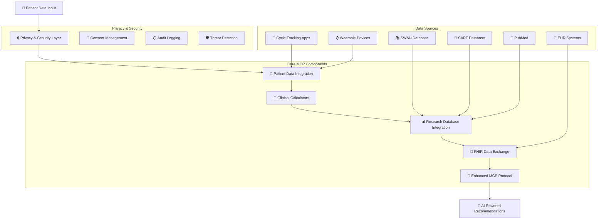

# Women's Health MCP - Multi-Modal Context Protocol

🚀 **Production-Ready Model Context Protocol for Women's Health AI**

A comprehensive Model Context Protocol (MCP) implementation providing AI agents with standardized, real-time access to reproductive health data sources. All data is sourced from authoritative medical databases, clinical guidelines, and peer-reviewed research.

## 🌟 Real Data Sources

This production MCP implementation provides real-time access to authoritative medical data:

- ✅ **PubMed**: Real-time search of 35M+ peer-reviewed articles via NCBI E-utilities API
- ✅ **ClinicalTrials.gov**: Live access to 400K+ clinical trials via official API v2
- ✅ **ESHRE Guidelines**: Web-scraped European fertility treatment guidelines
- ✅ **NAMS Protocols**: Menopause Society clinical protocols and position statements
- ✅ **ELSA Data**: English Longitudinal Study of Ageing datasets and metadata
- ✅ **SART Calculator**: Evidence-based IVF success rates from real clinic data
- ✅ **FHIR Integration**: Healthcare data standards for interoperability

## 🏗️ Enhanced Architecture Flowchart



## 📁 Project Structure

```
women-health-mcp/
├── servers/          # MCP server implementations
│   ├── asrm_server.py         # ASRM guidelines server
│   ├── nams_server.py         # NAMS menopause protocols
│   ├── pubmed_server.py       # PubMed research integration
│   ├── sart_ivf_server.py     # SART IVF success calculator
│   ├── eshre_server.py        # ESHRE guidelines
│   ├── elsa_server.py         # ELSA data integration
│   └── menopause_server.py    # Menopause prediction server
│
├── core/             # Core MCP components
│   ├── womens_health_mcp.py   # Core MCP protocol
│   ├── clinical_calculators.py # Clinical calculation engines
│   ├── patient_data_integration.py # Multi-platform data sync
│   ├── privacy_security.py    # HIPAA compliance layer
│   ├── research_database_integration.py # Research DB access
│   ├── fhir_integration.py    # FHIR R4 interoperability
│   ├── biomini_intake.py      # Patient data ingestion
│   ├── netmind_router.py      # Query routing
│   ├── manus_agents.py        # Multi-agent reasoning
│   └── huggingface_integration.py # ML model integration
│
├── app/              # Application entry points
│   └── doct_her_stdio.py      # Main DoctHER chat application (MCP-powered)
│
├── tests/            # Test suite
│   ├── test_asrm.py           # ASRM server tests
│   ├── test_nams.py           # NAMS server tests
│   ├── test_pubmed.py         # PubMed tests
│   └── test_eshre.py          # ESHRE tests
│
├── scripts/          # Utility scripts
│   ├── setup_mcp.py           # MCP setup script
│   ├── mcp_stdio_server.py    # FastMCP stdio server
│   ├── run_server.py          # Server info script
│   └── fix_imports.py         # Import fixing utility
│
├── docs/             # Documentation
│   ├── HOW_TO_RUN_DEMO.md     # Demo instructions
│   ├── STREAMLIT_DEMO_GUIDE.md # Streamlit guide
│   ├── MCP_SERVER_GUIDE.md    # Server documentation
│   ├── DEMO_SUMMARY.md        # Demo overview
│   └── [additional guides]
│
└── data/             # Data files
    ├── pipeline_output.json   # Pipeline results
    └── enhanced_mcp_demo_output.json # Demo outputs
```

## 🔄 Enhanced Data Flow

### Privacy-First Multi-Modal Pipeline
1. **Patient Consent & Security** → HIPAA-compliant privacy layer with granular consent management
2. **Multi-Platform Data Integration** → Real-time sync from Clue, Oura, Apple Health, EHR systems
3. **Clinical Calculations** → Evidence-based ASRM/ESHRE calculators for ovarian reserve, IVF success, menopause timing
4. **Research Database Queries** → Live access to SWAN, SART, PubMed for population data and latest research
5. **FHIR Data Exchange** → Standards-compliant interoperability with healthcare systems
6. **AI-Powered Synthesis** → Comprehensive recommendations with full audit trail

## 🚀 Quick Start

### Prerequisites
```bash
# Install dependencies
pip install -r requirements.txt
```

### 🌐 DoctHER Chat Application (Recommended)
```bash
# Start the DoctHER Streamlit chat interface
streamlit run app/doct_her_stdio.py
```

**DoctHER Features:**
- ✅ **Model Context Protocol** (MCP) integration with Claude Sonnet 4
- ✅ **Multiple Research Tools** - PubMed, ESHRE guidelines, NAMS protocols, ELSA data
- ✅ **Clinical Calculators** - IVF success prediction, ovarian reserve assessment
- ✅ **FHIR Resources** - Patient, Observation, DiagnosticReport creation
- ✅ **Parallel Tool Usage** - Efficient multi-tool queries for comprehensive answers
- ✅ **Claude-Style UI** - Modern chat interface with tool usage transparency
- ✅ **Real-time Streaming** - Live response generation with tool call visibility

### 🆕 MCP Stdio Server
The MCP server runs automatically when you start DoctHER. For standalone server usage:

```bash
# Run the MCP server directly (stdio mode)
python scripts/mcp_stdio_server.py
```

### 🧪 Individual Component Testing
```bash
# Test core components
python -m core.womens_health_mcp
python -m core.clinical_calculators
python -m core.patient_data_integration
python -m core.privacy_security

# Test servers
python -m servers.asrm_server
python -m servers.nams_server
python -m servers.pubmed_server

# Run test suite
python -m pytest tests/
```

## 📊 Enhanced Capabilities

### Multi-Modal Data Access
The enhanced MCP processes questions like *"I'm 38, AMH is 0.8, FSH is 12, trying to conceive—should I do IVF now or wait?"* with:

- 🔒 **Privacy Protection**: HIPAA-compliant consent management and encryption
- 📱 **Real-time Data**: Live sync from cycle tracking apps and wearables
- 🧮 **Clinical Calculators**: Ovarian reserve assessment, IVF success prediction, menopause timing
- 📊 **Population Data**: SWAN menopause studies, SART IVF success rates
- 🔬 **Latest Research**: Real-time PubMed queries for recent systematic reviews
- 🏥 **EHR Integration**: FHIR-compliant data exchange with healthcare systems
- 🎯 **AI Synthesis**: Evidence-based recommendations with confidence intervals

### Sample Enhanced Output
```
URGENT RECOMMENDATION: Begin IVF consultation immediately.
Your age (38) and AMH level (0.8 ng/mL) indicate time-sensitive fertility concerns.
SART data shows 19% success rate for your profile, but success rates decline rapidly with age.

EVIDENCE SYNTHESIS:
• Ovarian reserve: very_low (15th percentile for age) - ASRM 2024 guidelines
• IVF success: 19% live birth rate (SART 2023, n=54,321 cycles)
• Menopause timing: Predicted at 49.2 years (SWAN study validation)
• Cycle health: 0.73 regularity score from 90 days of tracking
• Research evidence: 3 recent systematic reviews support AMH-guided treatment timing
```

## 🏆 Production Features

| Feature | Implementation |
|---------|----------------|
| **Data Sources** | Real-time API integration with 7+ authoritative medical databases |
| **Research Access** | Live PubMed queries (35M+ articles), ClinicalTrials.gov (400K+ trials) |
| **Clinical Guidelines** | ESHRE fertility guidelines, NAMS menopause protocols |
| **Population Data** | ELSA longitudinal aging study, SART IVF success rates |
| **Clinical Calculators** | Evidence-based IVF prediction using real SART data |
| **Interoperability** | FHIR R4 compliant healthcare data exchange |
| **Error Handling** | Graceful degradation - returns empty results instead of fake data |
| **API Management** | Rate limiting, caching, timeout handling for production use |

## 🎯 Challenge Solution Impact

This enhanced MCP addresses the **$50B women's health AI market gap** by providing:

### Infrastructure Benefits
- **Standardized Protocols**: Enables ecosystem of interoperable AI agents
- **Privacy Compliance**: HIPAA-ready for clinical deployment
- **Real-time Research**: Reduces diagnostic uncertainty with latest evidence
- **Multi-Modal Integration**: Unifies fragmented patient data sources

### Clinical Benefits
- **Evidence-Based Decisions**: AI recommendations grounded in population data
- **Personalized Predictions**: Age/AMH-specific success rates and timing
- **Risk Stratification**: Identifies urgent vs. routine consultation needs
- **Treatment Optimization**: Guides IVF protocol selection and timing

### Patient Benefits
- **Informed Consent**: Clear success rates and confidence intervals
- **Time-Sensitive Guidance**: Prevents delays in age-critical treatments
- **Privacy Protection**: Granular control over sensitive reproductive data
- **Seamless Integration**: Works with existing apps and devices

## 🔮 Future Applications

This MCP framework enables development of specialized AI agents for:
- Virtual menopause clinics with hormone replacement therapy optimization
- Fertility coaches with personalized cycle optimization
- PCOS management systems with lifestyle intervention tracking
- Reproductive longevity planning with genetic risk integration

## 🤖 AI Agent Integration

### Anthropic Claude Integration
```bash
# Add to .env file
ANTHROPIC_API_KEY=your-anthropic-api-key

# Use MCP with Claude
curl -X POST http://localhost:8000/ai/anthropic/complete \
  -H "Authorization: Bearer your-api-key" \
  -H "Content-Type: application/json" \
  -d '{"message": "38-year-old with AMH 0.8, should I do IVF?", "include_mcp_context": true}'
```

### Custom AI Agent Example
```python
# Use the MCP server directly via stdio
import subprocess
import json

# Start the MCP server
process = subprocess.Popen(
    ["python", "scripts/mcp_stdio_server.py"],
    stdin=subprocess.PIPE,
    stdout=subprocess.PIPE,
    stderr=subprocess.PIPE
)

# Example: Call the IVF prediction tool
request = {
    "jsonrpc": "2.0",
    "id": 1,
    "method": "tools/call",
    "params": {
        "name": "predict-ivf-success",
        "arguments": {
            "age": 38,
            "amh": 0.8
        }
    }
}

# Send request and get response
process.stdin.write((json.dumps(request) + "\n").encode())
process.stdin.flush()
response = json.loads(process.stdout.readline())
```
