# Women's Health MCP - Enhanced Multi-Modal Context Protocol

🚀 **Solution to Challenge 5: Multi-Modal Context Protocol for Women's Health AI Agents**

A comprehensive Model Context Protocol (MCP) implementation that addresses the critical infrastructure gap in women's health AI systems. This enhanced MCP provides AI agents with standardized, real-time access to reproductive health data sources while maintaining HIPAA compliance and privacy protection.

## 🌟 Challenge Solution Overview

This implementation solves the core problem identified in Challenge 5: **the lack of standardized infrastructure for women's health AI systems**. Our enhanced MCP enables AI agents to access:

- ✅ **Clinical Data**: EHRs (FHIR), lab results, imaging
- ✅ **Research Databases**: SWAN, SART, PubMed, clinical trials  
- ✅ **Clinical Calculators**: Ovarian reserve, IVF success, menopause prediction
- ✅ **Guidelines**: ASRM, ESHRE treatment protocols
- ✅ **Patient-Generated Data**: Cycle tracking apps, wearables

## 🏗️ Enhanced Architecture Flowchart

```mermaid
graph TD
    A[👤 Patient Data Input] --> B[🔒 Privacy & Security Layer]
    B --> C[📱 Patient Data Integration]
    C --> D[🧮 Clinical Calculators]
    D --> E[📊 Research Database Integration]
    E --> F[🏥 FHIR Data Exchange]
    F --> G[🤖 Enhanced MCP Protocol]
    G --> H[🎯 AI-Powered Recommendations]

    I[🔄 Cycle Tracking Apps] --> C
    J[⌚ Wearable Devices] --> C
    K[🏥 EHR Systems] --> F
    L[📚 SWAN Database] --> E
    M[🧬 SART Database] --> E
    N[📖 PubMed] --> E

    subgraph "Privacy & Security"
        B
        O[🔐 Consent Management]
        P[📋 Audit Logging]
        Q[🛡️ Threat Detection]
    end

    subgraph "Data Sources"
        I
        J
        K
        L
        M
        N
    end

    subgraph "Core MCP Components"
        C
        D
        E
        F
        G
    end
```



## 📁 Enhanced File Structure

### 🚀 Enhanced MCP Components (Challenge Solution)
- **`womens_health_mcp.py`** - Core MCP protocol with standardized data source access
- **`clinical_calculators.py`** - ASRM/ESHRE validated calculators (ovarian reserve, IVF success, menopause)
- **`patient_data_integration.py`** - Unified interface for cycle tracking apps and wearables
- **`privacy_security.py`** - HIPAA-compliant security layer with encryption and audit trails
- **`research_database_integration.py`** - Real-time access to SWAN, SART, PubMed databases
- **`fhir_integration.py`** - FHIR R4 compliant data exchange for EHR interoperability
- **`enhanced_mcp_demo.py`** - Comprehensive demonstration of all enhanced capabilities

### 📊 Original Components (Baseline)
- **`main.py`** - Original demo entry point
- **`end_to_end_demo.py`** - Basic pipeline orchestration
- **`biomini_intake.py`** - Patient data ingestion and ASRM classification
- **`netmind_router.py`** - Query routing logic
- **`manus_agents.py`** - Multi-agent clinical reasoning system
- **`huggingface_integration.py`** - Research paper relevance ranking

### 🧪 Testing & Utilities
- **`test_demo.py`** - Non-interactive automated testing

## 🔄 Enhanced Data Flow

### Privacy-First Multi-Modal Pipeline
1. **Patient Consent & Security** → HIPAA-compliant privacy layer with granular consent management
2. **Multi-Platform Data Integration** → Real-time sync from Clue, Oura, Apple Health, EHR systems
3. **Clinical Calculations** → Evidence-based ASRM/ESHRE calculators for ovarian reserve, IVF success, menopause timing
4. **Research Database Queries** → Live access to SWAN, SART, PubMed for population data and latest research
5. **FHIR Data Exchange** → Standards-compliant interoperability with healthcare systems
6. **AI-Powered Synthesis** → Comprehensive recommendations with full audit trail

## 🚀 Quick Start

### Enhanced MCP Demonstration (Recommended)
```bash
python enhanced_mcp_demo.py
```

### Original Demo (Baseline)
```bash
python main.py
```

### Individual Component Testing
```bash
# Test enhanced components
python womens_health_mcp.py
python clinical_calculators.py
python patient_data_integration.py
python privacy_security.py
python research_database_integration.py
python fhir_integration.py

# Test original components
python biomini_intake.py
python netmind_router.py
python manus_agents.py
```

## 📊 Enhanced Capabilities

### Multi-Modal Data Access
The enhanced MCP processes questions like *"I'm 38, AMH is 0.8, FSH is 12, trying to conceive—should I do IVF now or wait?"* with:

- 🔒 **Privacy Protection**: HIPAA-compliant consent management and encryption
- 📱 **Real-time Data**: Live sync from cycle tracking apps and wearables  
- 🧮 **Clinical Calculators**: Ovarian reserve assessment, IVF success prediction, menopause timing
- 📊 **Population Data**: SWAN menopause studies, SART IVF success rates
- 🔬 **Latest Research**: Real-time PubMed queries for recent systematic reviews
- 🏥 **EHR Integration**: FHIR-compliant data exchange with healthcare systems
- 🎯 **AI Synthesis**: Evidence-based recommendations with confidence intervals

### Sample Enhanced Output
```
URGENT RECOMMENDATION: Begin IVF consultation immediately. 
Your age (38) and AMH level (0.8 ng/mL) indicate time-sensitive fertility concerns. 
SART data shows 19% success rate for your profile, but success rates decline rapidly with age.

EVIDENCE SYNTHESIS:
• Ovarian reserve: very_low (15th percentile for age) - ASRM 2024 guidelines
• IVF success: 19% live birth rate (SART 2023, n=54,321 cycles)  
• Menopause timing: Predicted at 49.2 years (SWAN study validation)
• Cycle health: 0.73 regularity score from 90 days of tracking
• Research evidence: 3 recent systematic reviews support AMH-guided treatment timing
```

## 🏆 Enhanced vs Original Features

| Capability | Original | Enhanced |
|------------|----------|----------|
| **Data Sources** | Static mock data | Real-time API integration (6+ platforms) |
| **Privacy** | None | HIPAA-compliant with encryption & audit |
| **Clinical Calculators** | Basic | ASRM/ESHRE validated algorithms |
| **Research Integration** | Mock papers | Live SWAN/SART/PubMed queries |
| **Interoperability** | Custom format | FHIR R4 compliant |
| **Patient Data** | Manual entry | Multi-app sync (Clue, Oura, etc.) |
| **Security** | Basic | AI-powered threat detection |
| **Consent Management** | None | Granular permissions with easy revocation |

## 🎯 Challenge Solution Impact

This enhanced MCP addresses the **$50B women's health AI market gap** by providing:

### Infrastructure Benefits
- **Standardized Protocols**: Enables ecosystem of interoperable AI agents
- **Privacy Compliance**: HIPAA-ready for clinical deployment  
- **Real-time Research**: Reduces diagnostic uncertainty with latest evidence
- **Multi-Modal Integration**: Unifies fragmented patient data sources

### Clinical Benefits  
- **Evidence-Based Decisions**: AI recommendations grounded in population data
- **Personalized Predictions**: Age/AMH-specific success rates and timing
- **Risk Stratification**: Identifies urgent vs. routine consultation needs
- **Treatment Optimization**: Guides IVF protocol selection and timing

### Patient Benefits
- **Informed Consent**: Clear success rates and confidence intervals
- **Time-Sensitive Guidance**: Prevents delays in age-critical treatments  
- **Privacy Protection**: Granular control over sensitive reproductive data
- **Seamless Integration**: Works with existing apps and devices

## 🔮 Future Applications

This MCP framework enables development of specialized AI agents for:
- Virtual menopause clinics with hormone replacement therapy optimization
- Fertility coaches with personalized cycle optimization
- PCOS management systems with lifestyle intervention tracking  
- Reproductive longevity planning with genetic risk integration